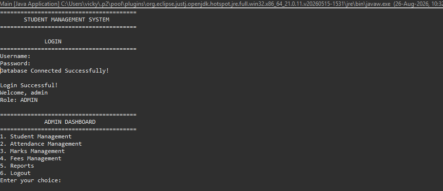
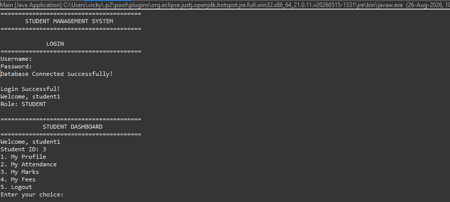
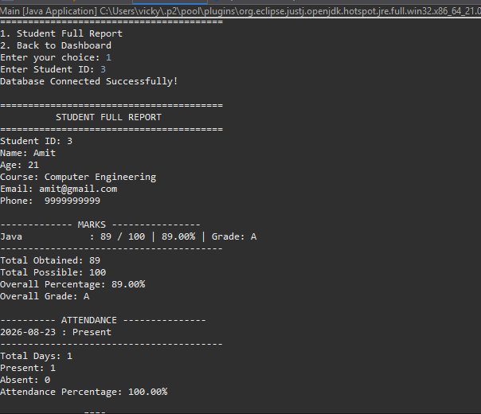

# Student Management System

A console-based Student Management System developed using Java, JDBC, and MySQL.

The application provides separate Admin and Student dashboards for managing student information, attendance, marks, fees, and reports.

---

## 📌 About

This project is a menu-driven Java application connected to a MySQL database using JDBC.

The system supports:

- Student management
- Admin login
- Student login
- Attendance management
- Marks management
- Fees management
- Student profiles
- Student reports
- Input validation
- Role-based dashboards

---

## 🚀 Features

### 👨‍💼 Admin Module

#### 1. Admin Login

Admin can access the Admin Dashboard using username and password.

#### 2. Student Management

- Add Student
- View All Students
- Search Student
- Update Student
- Delete Student

Student information includes:

- Student ID
- Name
- Age
- Course
- Email
- Phone

#### 3. Attendance Management

- Mark Attendance
- View All Attendance
- View Student Attendance
- Present/Absent status
- Attendance percentage
- Attendance summary

#### 4. Marks Management

- Add Marks
- View All Marks
- View Student Marks
- Subject-wise marks
- Percentage calculation
- Grade calculation
- Overall result

#### 5. Fees Management

- Add Fee
- View All Fees
- View Student Fees
- Payment status
- Payment method
- Total fee
- Paid amount
- Pending amount

#### 6. Reports

Generate a complete Student Full Report containing:

- Student details
- Marks
- Percentage
- Grade
- Attendance
- Attendance percentage
- Fee details
- Fee summary

---

## 👨‍🎓 Student Module

Students can login using their own credentials.

### Student Dashboard

- My Profile
- My Attendance
- My Marks
- My Fees
- Logout

### My Profile

Displays:

- Student ID
- Name
- Age
- Course
- Email
- Phone

### My Attendance

Displays:

- Attendance records
- Total days
- Present days
- Absent days
- Attendance percentage

### My Marks

Displays:

- Subject
- Obtained marks
- Total marks
- Percentage
- Grade
- Overall percentage
- Overall grade

### My Fees

Displays:

- Fee ID
- Amount
- Payment date
- Payment status
- Payment method
- Total fee
- Paid amount
- Pending amount

---

## 🛠️ Technologies Used

- Java
- Core Java
- OOP
- JDBC
- MySQL
- Eclipse IDE
- Git
- GitHub

---

## 🏗️ Project Architecture

The project follows a simple layered architecture:

```text
Main
  |
  v
DAO Layer
  |
  v
MySQL Database
```

### Model Layer

Contains Java classes representing application data.

- Student.java
- User.java
- Attendance.java
- Marks.java
- Fees.java

### DAO Layer

Handles database operations.

- StudentDAO.java
- UserDAO.java
- AttendanceDAO.java
- MarksDAO.java
- FeesDAO.java
- ReportDAO.java

### Main Layer

Main.java handles:

- Login
- Admin Dashboard
- Student Dashboard
- Menu operations
- User input

### Utility Layer

DBConnection.java handles the MySQL database connection.

---

## 📸 Screenshots

### Admin Dashboard



### Student Dashboard



### Student Report



---

## 📂 Project Structure

```text
StudentManagementSystem
|
+-- src
|   |
|   +-- studentmanagement
|       |
|       +-- dao
|       |   +-- AttendanceDAO.java
|       |   +-- FeesDAO.java
|       |   +-- MarksDAO.java
|       |   +-- ReportDAO.java
|       |   +-- StudentDAO.java
|       |   +-- UserDAO.java
|       |
|       +-- main
|       |   +-- Main.java
|       |
|       +-- model
|       |   +-- Attendance.java
|       |   +-- Fees.java
|       |   +-- Marks.java
|       |   +-- Student.java
|       |   +-- User.java
|       |
|       +-- util
|           +-- DBConnection.java
|
+-- screenshots
|   +-- admin-dashboard.png
|   +-- student-dashboard.png
|   +-- student-report.png
|
+-- database.sql
+-- README.md
```

---

## 🗄️ Database

Database name:

```text
student_db
```

Main tables:

```text
users
students
attendance
marks
fees
```

### Database Relationship

```text
users
  |
  | student_id
  v
students
  |
  +-------------> attendance
  |
  +-------------> marks
  |
  +-------------> fees
```

The `student_id` field connects student records with their attendance, marks, and fee records.

---

## 🔐 Demo Login Credentials

### Admin

```text
Username: admin
Password: admin123
Role: ADMIN
```

### Student

```text
Username: student1
Password: student123
Role: STUDENT
Student ID: 3
```

> These credentials are for local/demo testing only.

---

## ▶️ How to Run

### 1. Install Java

Install Java JDK on your system.

### 2. Install MySQL

Install MySQL Server.

### 3. Open Project

Open the project in Eclipse IDE.

### 4. Create Database

```sql
CREATE DATABASE student_db;
```

Then:

```sql
USE student_db;
```

### 5. Create Required Tables

The complete database setup is available in:

```text
database.sql
```

The SQL file contains the required tables:

- users
- students
- attendance
- marks
- fees

### 6. Configure Database Connection

Open:

```text
DBConnection.java
```

Configure your MySQL:

- Database URL
- Username
- Password

### 7. Add MySQL Connector

Add MySQL Connector/J to the Eclipse project build path.

### 8. Run Application

Run:

```text
Main.java
```

---

## 📊 Sample Student Report

```text
Student ID: 3
Name: Amit
Course: Computer Engineering

Marks:
Java : 89 / 100
Overall Percentage: 89.00%
Overall Grade: A

Attendance:
Total Days: 1
Present: 1
Absent: 0
Attendance Percentage: 100.00%

Fees:
Total Fee: ₹75000
Paid Amount: ₹75000
Pending Amount: ₹0
```

---

## 🔄 Version History

### v1.0

- Initial Student Management System
- Student CRUD operations
- MySQL database integration
- JDBC connectivity

### v2.0

- Login Module
- Admin Dashboard
- Attendance Module
- Marks Module
- Fees Module

### v3.0

- Student Dashboard
- Student Login
- Student ID linking
- My Profile
- My Attendance
- Attendance Summary
- My Marks
- Percentage and Grade
- Overall Result
- My Fees
- Fee Summary
- Student Full Reports
- Input validation
- Complete CRUD operations

---

## 🔮 Future Improvements

- Password hashing
- Java Swing / JavaFX GUI
- Search by name or course
- Export reports to PDF
- Email notifications
- Better exception handling
- Advanced reporting

---

## 👨‍💻 Author

**Vickt2006**

Student Management System developed using Java, JDBC, and MySQL.